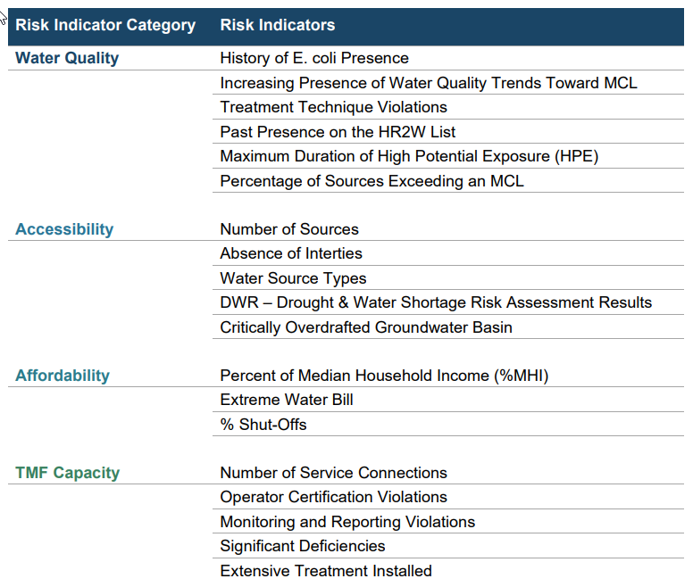
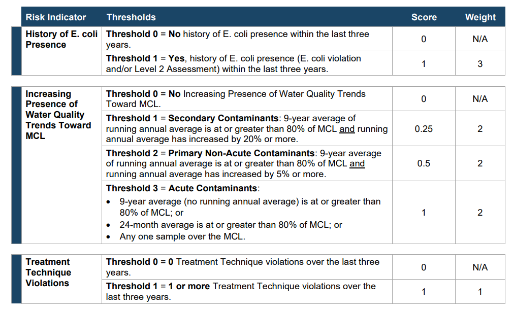
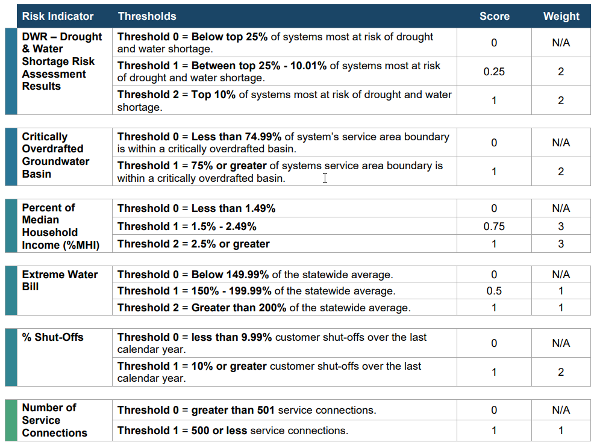
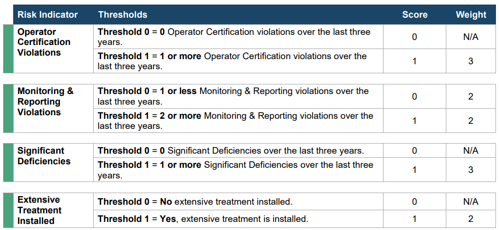

# Abstract {#sec-abstract}

This will be a great abstract summarizing everything succinctly and also
making sure that people want to read the rest of my paper. It will be
intriguing and informative.

# Introduction {#sec-introduction}

California drinking water is safe for 98% [@2024needsreport] of the
population and meets state drinking water standards that are more strict
than federal regulations. This still leaves about 400 failing water
systems serving 870,000 people, 600 water systems serving 1.6 million
people that are at risk of failure, and more than 400 others serving
another 1.6 million that are potentially at risk of failing.
[@waterfail] Smaller communities and populations that are economically
disadvantaged may be more at risk of having water with higher levels of
contaminants, or they may not have the resources to address and fix
problems with the water system.

In 2016 the California State Water Resource Board adopted a Human Right
to Water Resolution that includes a statement that "every human being
has the right to safe, clean, affordable, and accessible water adequate
for human consumption, cooking and sanitary purposes." The goals of
Human Right to Water are to provide safe drinking water, accessible
drinking water, affordable drinking water, and/or maintaining a
sustainable and resilient water system. In 2019 California established
the Safe and Affordable Funding for Equity and Resilience (SAFER)
Program with the goal of helping struggling water systems and to help
provide affordable safe drinking water. In 2021 SAFER performed a Needs
Assessment to try to determine where and how funds should be used to
have the most impact in improving failing or at risk water systems and
provided recommendations.

The California State Water Board conducted the risk assessment with 19
indicators across four categories. The categories were Water Quality,
Accessibility, Affordability, and Technical, Managerial, and Financial
(TMF) Capacity. Each year the Needs Assessment was updated and the data
published with risk assessment scores for each category. This paper will
focus on 2024 data and the scores from each of the categories from
communities with fewer than 3300 service connections.

Funding has been provided to try and address inequities in small water
systems and fix problems in a sustainable way. This paper will
investigate to see if there are correlations between economic status of
the population a small water system serves and indicator scores.

This paper will describe the data from the Drinking Water Needs
Assessment and relevant variables, describe the general simple linear
regression model used to analyze potential correlations, and then show
the results of the linear regression and residual analysis.

# Data {#sec-data}

This paper uses data from the 2024 Drinking Water Needs Assessment
report [@2024needsreport] through the SAFER program and definitions from
the original 2021 Drinking Water Needs Assessment report
[@2021needsreport]. The reports were prepared by the California State
Water Resources Control Board within the California Environmental
Protection Agency (CalEPA), in partnership with the UCLA Luskin Center
for Innovation (UCLA).

The report calculated a risk assessment value for each water system. The
Risk Assessment Result is based off of a score for each of 19 risk
indicators (see figure below). A standardized score is a value between 0
and 1. Weight values between 1 and 3 were applied to the individual risk
indicators. This resulted in a score value for each subcategory. A total
weighted risk value was calculated using the four subcategories scores.
The result was used to indicate if the water system was At-Risk,
Not-At-Risk, or Potentially-At-Risk. Some systems were not evaluated and
have a Not Assessed value.

{fig-align="center" width="542"}

All "At Risk" systems exceed a 'threshold of concern' (see
@sec-thresholds for specific values) for at least four risk indicators.

This paper looks at the individual subcategory scores from the Risk
Assessment, a California Environmental Screening Score, population, and
Median Household Income (MHI), and investigates the possible
relationships between those variables. The subcategories are Water
Quality, Affordability, Accessibility, and TMF Capacity. (See longer
definitions from the Needs Assessment report @sec-definitions)

The CalEnviroScreen [@calenviro] is a score created by the State of
California Office of Environmental Health Hazard Assessment (OEHHA) that
uses environmental, health, and socioeconomic information to produce
scores for every census tract in the state. A higher score is an area
that has a higher pollution burden than a lower score. Below is a
scatterplot of the CalEnvironScreen score compared to MHI for that water
system. Only smaller water systems with fewer than 3300 service
connections are included. Each data point is colored to show if the
water system is at risk of failing to provide clean drinking water.

::: {.cell}
::: {.cell-output-display}
{#fig-calenviron-mhi}
:::
:::

The Median Household Income (MHI) uses the annual income value for all
the people in a single household. The MHI for this data set is the
median household annual income for the population in each water system.
The median household income is a typical value that is used as a general
economic measure and as a way to compare populations. On an individual
level, MHI can be used to determine if you qualify for certain aid. In
this data set MHI is one way to compare different populations served by
different water systems.

The Needs Assessment spent time trying to figure out a threshold for
what would make water unaffordable to the residents of that water
system. Affordability in this data set is based on three measured
values: the percent of the MHI, a comparison to the state average water
bill, and the number of shut-offs of water. [@sec-thresholds]

Accessibility is a combination of five indicators that include how many
sources a water system has, if the system is reliant on connetions to
other systems, and what types of sources (groundwater, snow, rivers,
etc.) This score also includes information about droughts and
overdrafted water basins.

TMF Capacity risk indicators measure a system’s technical, managerial
and financial (TMF) capacity to actually maintain a water system long
term.

# Methods {#sec-methods}

This paper looks at the results of a simple linear regression model
shown below.

$$Y_i = \beta_0 +\beta_1 X_i + \varepsilon_i$$

$Y_i$ represents the response variable. In this analysis the response
variable is

$X_i$ represents the predictor variable. In this analysis the predictor
variable is

$\beta_0$ is the y-intercept of the model.

$\beta_1$ is the slope of the model. The slope represents how much the
response variable changes for a unit change in the predictor variable.
In this model

The analysis was done using R programming {@rcode} and built in
function, lm, to fit the linear model and provide calculated estimate
values for the slope and intercept of the model. The summary function of
the lm model also shows a p-value for each of the estimates and a $R^2$
value.

# Results {#sec-results}

After a couple years of funding and some improvements to small water
systems in California, are there correlations between risk indicator
scores? To begin this analysis we looked at a scatterplot of the
CalEnviroScreen Score and MHI @fig-calenviron-mhi shown in the Data
Section [@sec-data] of this paper. The larger the CalEnviroScreen Score,
the more pollution a population is subject to. General pollution may or
may not directly impact water quality. The scatterplot below indicates
lower MHI seems to have more At-Risk water systems. The larger the value
of the MHI for the water system, the fewer water systems that have high
CalEnviroScreen score.

::: {.cell}
::: {.cell-output-display}

:::
:::

The scatterplot above again graphs CalEnviroScreen Score against MHI,
but this time groups by the economic status of the service area. The
status could be a Disadvantaged Community (DAC), a Severely
Disadvantaged Community (SDAC), or a Non-Disadvantaged Community
(Non-DAC). The classifications of how disadvantaged a community is is a
direct calculation based on MHI, as shown by the vertical sections on
the scatterplot. Both the DAC and SDAC communities have a large range of
CalEnviroScreen Scores. The Non-DAC communities have a smaller range of
values and the values are less in general.

::: {.cell}

:::

The SDAC communities CalEnviroScreen Score ranged from 4.551 to 69.86 with and average value of 28.688. The DAC communities CalEnviroScreen Score ranged from 4.035 to 73.036 with and average value of 24.858.The Non-DAC communities CalEnviroScreen Score ranged from 1.372 to 56.183 with and average value of 16.389.

# Appendix A DEFINITIONS {#sec-definitions}

“Affordability Threshold” means the level, point, or value that
delineates if a water system’s residential customer charges, designed to
ensure the water systems can provide drinking water that meets State and
Federal standards, are unaffordable. For the purposes of the 2021
Affordability Assessment, the State Water Board employed affordability
thresholds for the following indicators: Percent Median Household
Income; Extreme Water Bill; and Percent Shut-Offs. Learn more about
current and future indicators and affordability thresholds in Appendix
E.

“Affordability Assessment” means the identification of any community
water system that serves a disadvantaged community that must charge fees
that exceed the affordability threshold established by the State Water
Board in order to supply, treat, and distribute potable water that
complies with Federal and state drinking water standards. The
Affordability Assessment evaluates several different affordability
indicators to identify communities that may be experiencing
affordability challenges. (Health & Saf. Code, § 116769, subd. (2)(B).

“At-Risk public water systems” or “At-Risk PWS” means community water
systems with 3,300 service connections or less and K-12 schools that are
at risk of failing to meet one or more key Human Right to Water goals:
(1) providing safe drinking water; (2) accessible drinking water; (3)
affordable drinking water; and/or (4) maintaining a sustainable water
system.

“Median household income” or “MHI” means the household income that
represents the median or middle value for the community. The methods
utilized for calculating median household income are included in
Appendix A and Appendix E. Median household incomes in this document are
estimated values for the purposes of this statewide assessment. Median
household income for determination of funding eligibility is completed
on a system by system basis by the State Water Board’s Division of
Financial Assistance.

“Risk indicator” means the quantifiable measurements of key data points
that allow the State Water Board to assess the potential for a community
water system or a transient noncommunity water system that serves a K-12
school to fail to sustainably provide an adequate supply of safe
drinking water due to water quality, water accessibility, affordability,
institutional, and/or TMF capacity issues.

“Risk threshold” means the levels, points, or values associated with an
individual risk indicator that delineates when a water system is more
at-risk of failing, typically based on regulatory requirements or
industry standards.

“Score” means a standardized numerical value that is scaled between 0
and 1 for risk points across risk indicators. Standardized scores enable
the evaluation and comparison of risk indicators.

“Service connection” means the point of connection between the
customer’s piping or constructed conveyance, and the water system’s
meter, service pipe, or constructed conveyance, with certain exceptions
set out in the definition in the Health and Safety Code. (See Health &
Saf. Code, § 116275, subd. (s).)

“Small community water system” means a CWS that serves no more than
3,300 service connections or a yearlong population of no more than
10,000 persons. (Health & Saf. Code, § 116275, subd. (z).)

"Risk Indicators" means quantifiable measurements of key data points
that allow the State Water Board to assess the probability of a water
system’s failure to deliver safe drinking water or other infrastructure
and institutional failures. Risk indicators that measure water quality,
accessibility, affordability, and TMF capacity are incorporated based on
their criticality as it relates to a system’s ability to remain in
compliance with safe drinking water standards and their data
availability and quality across the State.

"Risk Indicator Thresholds" are the levels, points, or values associated
with an individual risk indicator that delineates when a water system is
more at-risk of failing.

"Scores & Weights" are the application of a multiplying value or weight
to each risk indicator and risk category, as certain risk indicators and
categories may be deemed more critical than others and/or some may be
out of the control of the water system. The application of weights to
risk indicators and risk categories allows the State Water Board
multiple ways to assess all risk indicators within each category
together in a combined Risk Assessment score.

"TMF Capacity" risk indicators measure a system’s technical, managerial
and financial (TMF) capacity to plan for, achieve, and maintain long
term compliance with drinking water standards, thereby ensuring the
quality and adequacy of the water supply.

# Apendix B THRESHOLD VALUES {#sec-thresholds}

{fig-align="center"}

{fig-align="center"}

{fig-align="center"}

{fig-align="center"}

# References

